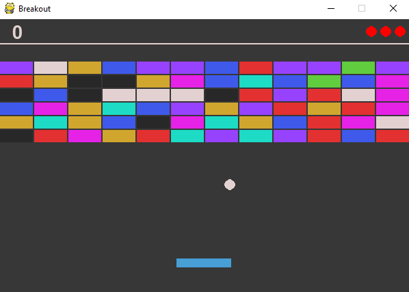

# Atari Breakout
## Idea
This is a clone with some personal features of old Breakout game written in Python with PyGame module.

## How to run?
Firstly clone repository to your computer
```bash
git clone https://github.com/frankofil/Atari-Breakout.git
```
Go to downloaded folder and install additional packages
```bash
pip install -r requirements.txt
```
Now you are good to go. To run program simply run
```bash
python script.py
```
### How to play?
To move a paddle use left and right arrows
### Score system
1. For each destroyed brick (except black ones), the player gets 20 points
2. For each destroyed black brick, the player gets 100 points by the game speeds up
3. For clearing whole level, the player gets 500 points 
